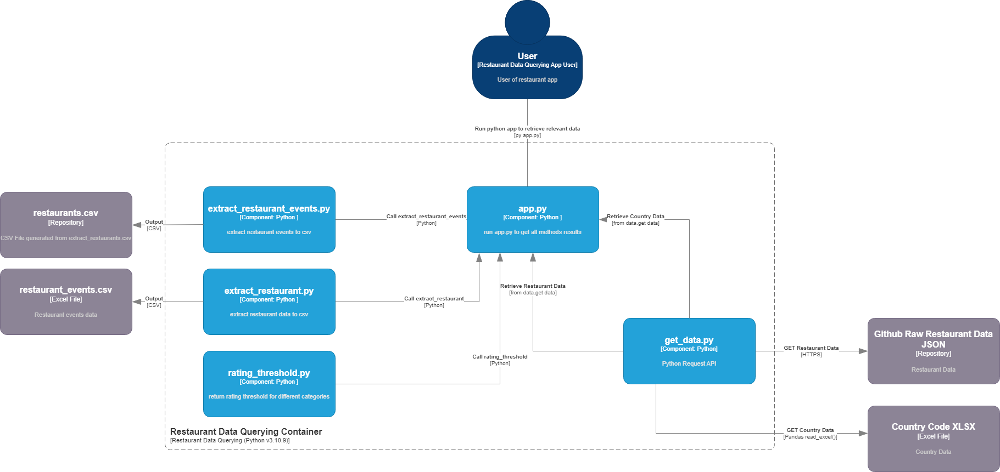

# Take-home Assignment for Data Engineer Intern

## Dependencies

### Language
python v3.10.9
### Installing Dependencies
- In Command Prompt: navigate to root folder of project
- `pip install -r requirements.txt`

## To run Script
- In Command Prompt: navigate to root folder of project
- `py app.py`

### Outputs
- The outputs for methods that return csv files can be found in the directory from root: `./csv_output` 
- The threshold score will be printed to console when `app.py` is run

## Considerations

### Application Design
- Built the app in attempts to follow the "Don't Repeat Yourself" principles.
- Created functions according to the Single-responsibility principles

### Possible cloud implementations
- The application and components can be containerized using docker.
- These components then can then be hosted as their own microservices or as a whole app, taking in inputs from user or consuming an API, hosted on either localhost or on a cloud provider which allows docker hosting.

## Component Diagram

